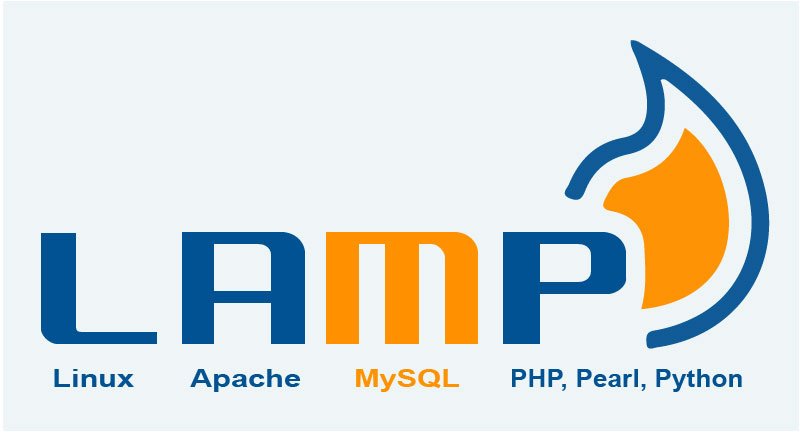
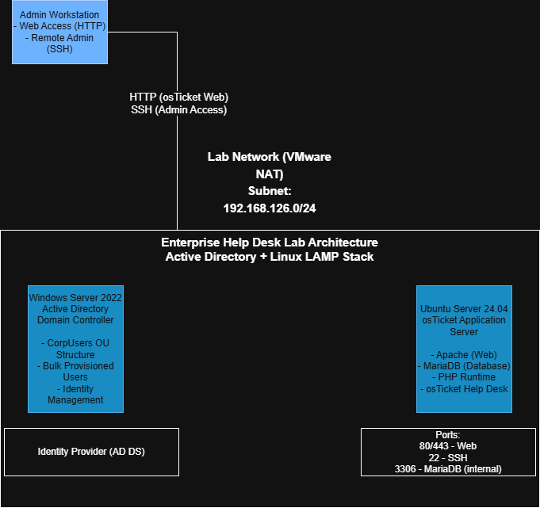
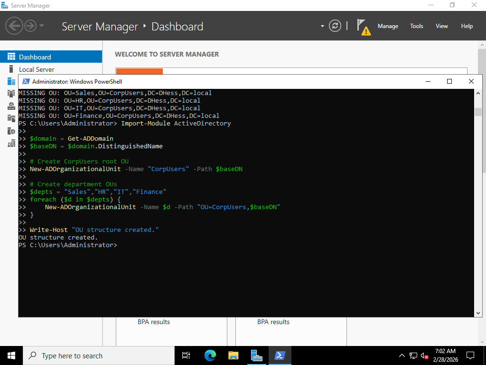
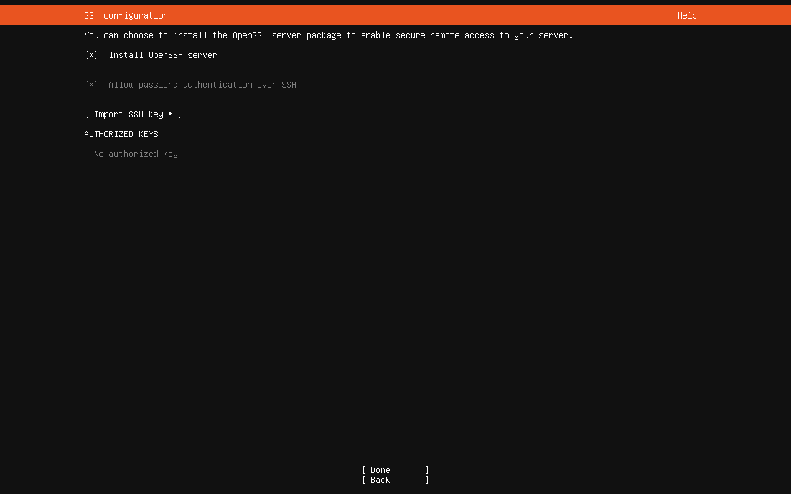
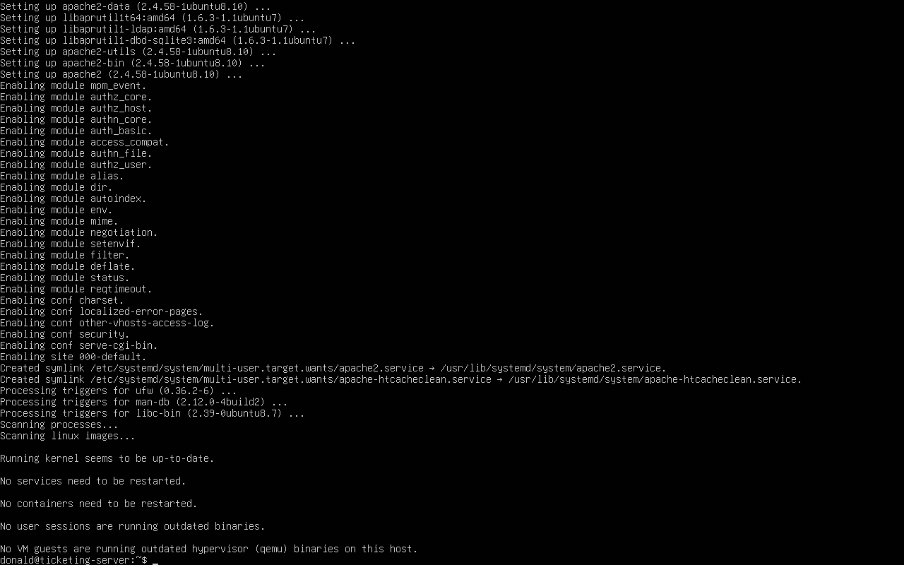
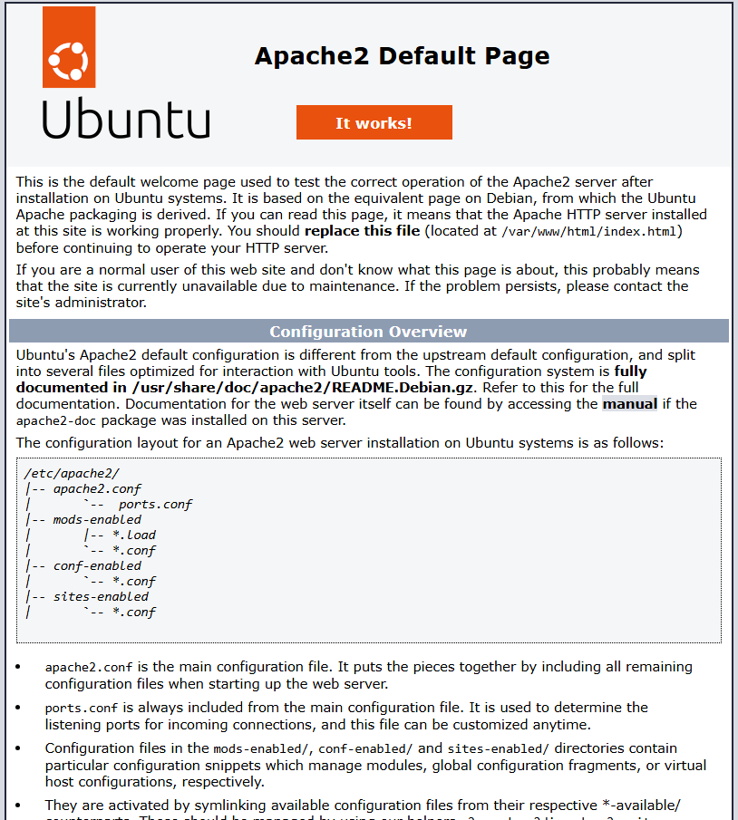
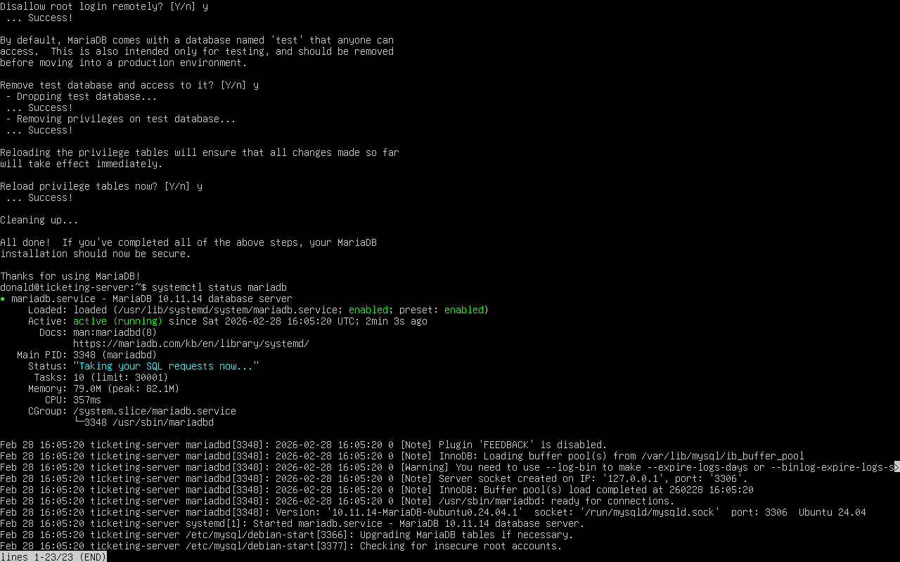
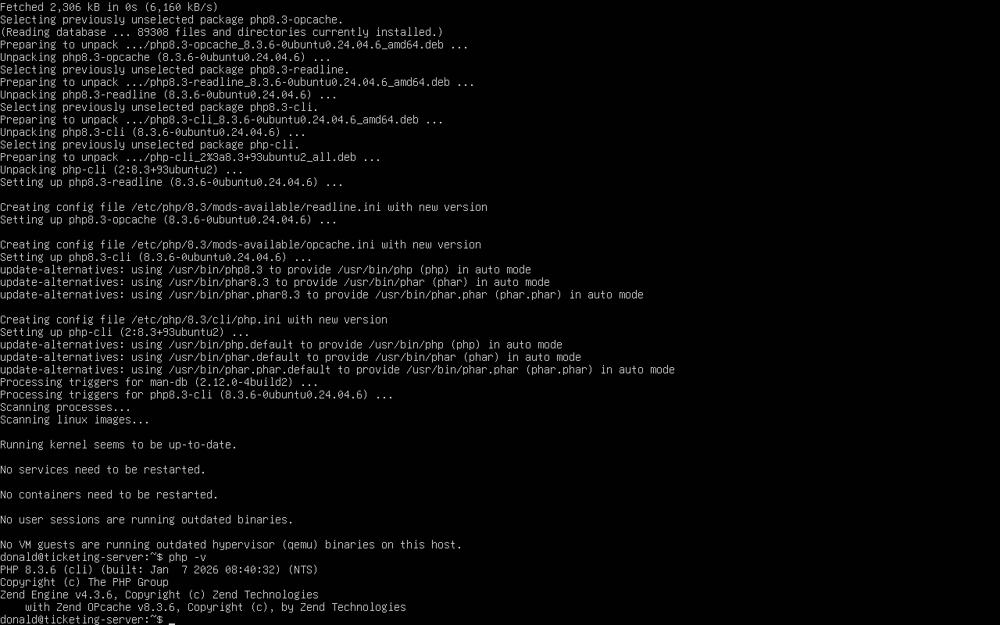
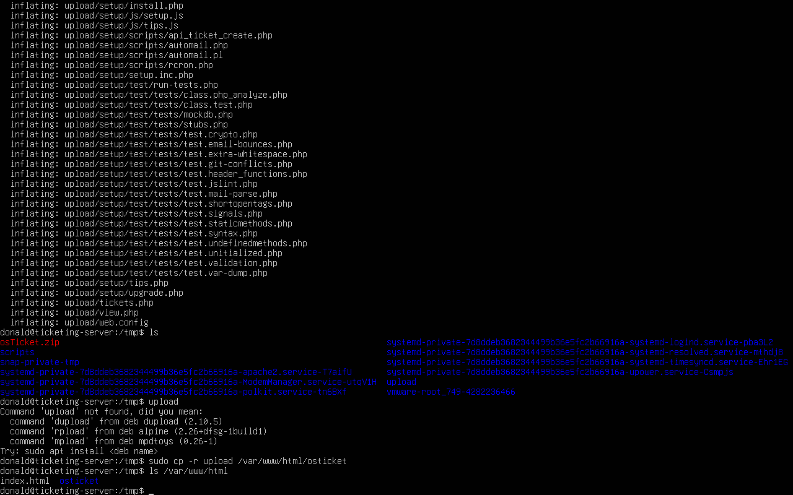
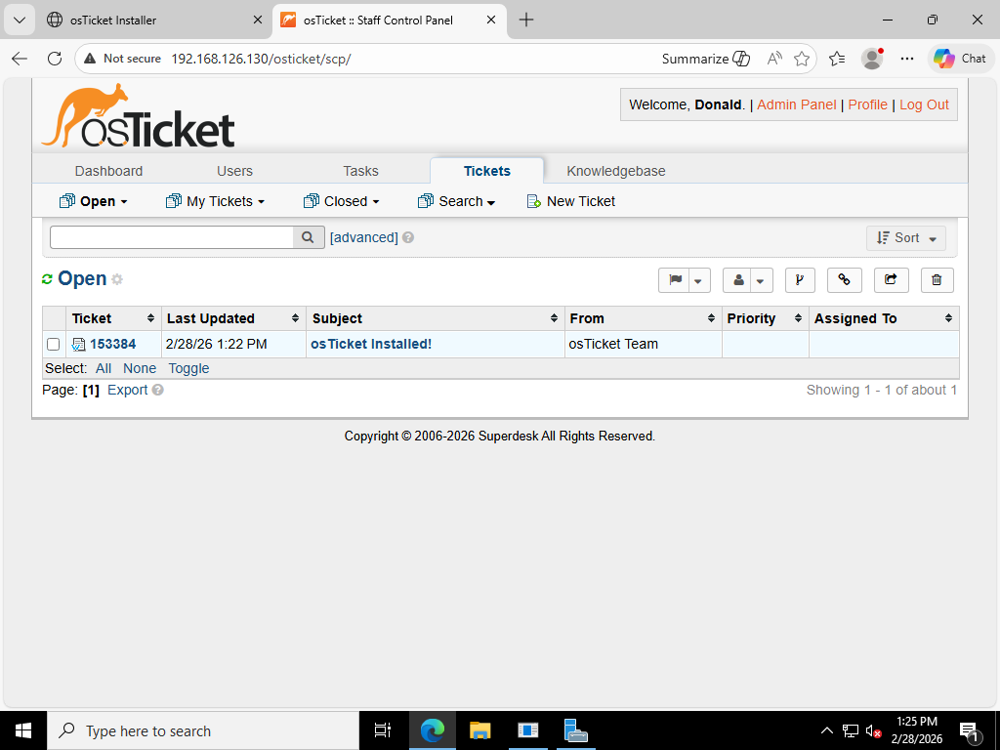

<h1 align="center">Enterprise-IT-Helpdesk-Lab-LAMP-AD</h1>

<p align="center">
Enterprise help desk simulation lab featuring Active Directory, a full LAMP stack, and osTicket ticketing workflows.
</p>

<p align="center">
  
</p>

---

## Executive Summary
This project simulates a small enterprise help desk environment backed by Active Directory and a Linux-hosted osTicket deployment on a full LAMP stack (Linux, Apache, MariaDB, PHP). The lab demonstrates identity management, infrastructure deployment, service validation, and real-world help desk tooling in an end-to-end environment.

---

## Architecture
<p align="center">
  
</p>

**Core components**
- **Windows Server 2022 (AD DS)** — Identity provider, OU structure, automated provisioning
- **Ubuntu Server (LAMP)** — Apache + PHP frontend with MariaDB backend
- **osTicket** — Web-based help desk platform
- **Admin / Client Systems** — Browser access + SSH administration
- **Lab Network** — Isolated VMware-based enterprise-style subnet

---

## Table of Contents
- [Executive Summary](#executive-summary)
- [Architecture](#architecture)
- [Tech Stack](#tech-stack)
- [Build Phases](#build-phases)
  - [Phase 1 — Active Directory Foundation](#phase-1--active-directory-foundation)
  - [Phase 2 — LAMP Stack Deployment](#phase-2--lamp-stack-deployment)
  - [Phase 3 — osTicket Deployment](#phase-3--osticket-deployment)
- [Deployment Walkthrough](#deployment-walkthrough)
- [Lessons Learned](#lessons-learned)
- [Roadmap](#roadmap)

---

## Tech Stack
- **Windows Server 2022** (Active Directory Domain Services)
- **Ubuntu Server** (Linux LAMP stack)
- **Apache** (Web layer)
- **MariaDB** (Database layer)
- **PHP** (Application runtime)
- **osTicket** (Help desk platform)

---

## Build Phases
<p><em>Phases are presented as collapsible sections for readability. Expand each to view implementation details and validation artifacts.</em></p>

<a id="phase-1--active-directory-foundation"></a>
<details>
<summary><b>📁 Phase 1 — Active Directory Foundation</b></summary>

<br>

### Step 1 — Automated OU Structure (PowerShell)
Created an enterprise-style OU hierarchy using PowerShell automation to support departmental segmentation and future policy targeting (GPOs).

**Outcome**
- Created root OU: **CorpUsers**
- Created department OUs: **Sales, HR, IT, Finance**
- Verified successful creation via PowerShell output

```powershell
Import-Module ActiveDirectory

$domain = Get-ADDomain
$baseDN = $domain.DistinguishedName

# Create CorpUsers root OU
New-ADOrganizationalUnit -Name "CorpUsers" -Path $baseDN

# Create department OUs
$depts = "Sales","HR","IT","Finance"
foreach ($d in $depts) {
    New-ADOrganizationalUnit -Name $d -Path "OU=CorpUsers,$baseDN"
}

Write-Host "OU structure created."
```

<p align="center">
  
</p>


</details>

---

<a id="phase-2--lamp-stack-deployment"></a>
<details>
<summary><b>📁 Phase 2 — LAMP Stack Deployment</b></summary>

<br>

### Step 1 — Linux Server Baseline + SSH Access
Provisioned the Ubuntu Server VM and enabled **OpenSSH** to support secure remote administration from the Windows/admin workstation.

**What this accomplishes**
- Establishes secure remote management (SSH)
- Confirms the server is reachable on the network
- Provides a stable baseline before installing the application stack

```bash
# Install and enable OpenSSH
sudo apt update
sudo apt install -y openssh-server

# Start + enable SSH
sudo systemctl enable ssh
sudo systemctl start ssh

# Verify SSH is running
sudo systemctl status ssh --no-pager

# Confirm network identity (helpful for troubleshooting)
hostnamectl
ip a
```

<p align="center">
  
</p>

---

### Step 2 — Install Apache (Web Server Layer)
Installed **Apache2** to serve as the HTTP front-end for the osTicket web application.

**What this accomplishes**
- Handles inbound HTTP requests
- Serves web content to clients on the lab network
- Provides the foundation for PHP + osTicket

```bash
# Install Apache
sudo apt install -y apache2

# Start + enable Apache
sudo systemctl enable apache2
sudo systemctl start apache2

# Verify service status
sudo systemctl status apache2 --no-pager
```

<p align="center">
  
</p>

---

### Step 3 — Validate Apache from a Client Browser
Confirmed the web server is reachable by loading the **Apache2 Default Page** from a client machine using the server’s IP address.

**What this proves**
- Apache is running correctly
- Network connectivity between client ↔ server is working
- HTTP (port 80) access is functioning inside the lab network

```bash
# Identify server IP (use this in your browser)
ip a

# Local validation from the server
curl -I http://localhost

# Optional: confirm Apache is listening on port 80
sudo ss -lntp | grep ':80'
```

<p align="center">
  
</p>

---

### Step 4 — Install + Harden MariaDB (Database Layer)
Installed **MariaDB** as the database backend for osTicket and performed baseline hardening using `mysql_secure_installation`.

**What this accomplishes**
- Provides persistent storage for tickets, users, and settings
- Applies secure defaults (removes test DB, locks down accounts, etc.)
- Confirms database service health before application deployment

```bash
# Install MariaDB
sudo apt install -y mariadb-server

# Start + enable MariaDB
sudo systemctl enable mariadb
sudo systemctl start mariadb

# Baseline hardening
sudo mysql_secure_installation

# Verify service status
sudo systemctl status mariadb --no-pager
```

<p align="center">
  
</p>

---

### Step 5 — Install + Validate PHP (Application Runtime)
Installed **PHP** and common extensions required for osTicket, then validated the runtime with `php -v`.

**What this accomplishes**
- Enables dynamic PHP execution via Apache
- Adds required modules used by osTicket
- Confirms the runtime layer is ready before deploying the app

```bash
# Install PHP + common osTicket-compatible extensions
sudo apt install -y php php-cli php-mysql php-imap php-intl php-xml php-mbstring php-curl php-gd

# Verify PHP runtime
php -v

# Optional: verify Apache sees PHP module (varies by config)
apache2ctl -M | grep php || true
```

<p align="center">
  
</p>

</details>

---

<details>
<summary><b>📁 Phase 3 — osTicket Deployment</b></summary>

<br>

### Step 1 — Download osTicket from GitHub
Downloaded the official osTicket release directly onto the Linux server. This confirms outbound connectivity and stages the installer package locally.

**What this accomplishes**
- Pulls the official upstream release
- Validates network access from the server
- Prepares the installer archive for extraction

```bash
cd /tmp

# Download osTicket release
wget https://github.com/osTicket/osTicket/releases/download/v1.18.3/osTicket-v1.18.3.zip -O osTicket.zip

# Confirm download
ls -lh
```

<p align="center">
  
</p>

---

### Step 2 — Extract and Deploy to Apache Web Root
Extracted the archive and copied the application files into Apache’s document root so they can be served over HTTP.

**What this accomplishes**
- Extracts the osTicket application files
- Deploys the `upload` directory into Apache root
- Makes the installer accessible via browser

```bash
# Extract archive
unzip osTicket.zip

# Deploy to Apache root
sudo cp -r upload /var/www/html/osticket

# Verify deployment
ls /var/www/html
```

<p align="center">
  
</p>

---

### Step 3 — Complete Web Installer and Validate Deployment
Accessed the osTicket web installer and confirmed a successful deployment by logging into the staff control panel.

**What this proves**
- Apache + PHP stack is functioning correctly
- Database connectivity is working
- osTicket is fully operational

**Validation**
- Navigated to: `http://<server-ip>/osticket`
- Completed the browser installer
- Created admin account
- Verified ticket dashboard loads

<p align="center">
  
</p>

</details>
